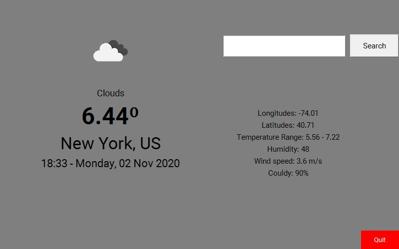

# Weather App Tkinter :100:

The Weather App Tkinter is an application made with :snake: Python Tkinter library that displays
the __weather information__ like (temperature, pressure, humidity) and the __timezone__ of the city
entered in the search box.

If you have Python already installed you can clone this repository and run `cli.py` file which is
in the project directory by opening your terminal or command prompt and type `python cli.py`. This
displays the weather app window but __make sure you have all dependencies installed__.

You can also download the full functioning application made by `pyinstaller` by clicking [here](https://github.com/sam0132nodier/weather-app-tkinter/raw/master/dist/WeatherApp.exe)
or cloning the repository and navigate to dist repository.

Double click on the download software and the app will run, enter the city or the zip code with
the country information and then you'll be able to see the weather information of the place displayed.

## App dependencies
- tkinter (Can be installed by `pip install tkinter`)
- Image, ImageTk from PIL (Can be installed by `pip install pillow`)
- requests (Can be installed by `pip install requests`)
- localtime, strftime from time (Came with my `python3.8`)
- BytesIO from io (Came with my `python3.8`)
- os (Came with my `python3.8`)
- sys (Came with my `python3.8`)

## App Specifications

- Create a tkinter window
- Add 2 frames (for results and for search)
- Create an API from [OpenWeatherMap](https://openweathermap.org/)
- Fetch the data from the server
- Use the generated JSON file to display data
- Create an executable using PyInstaller
- Link the executable in the project README.md